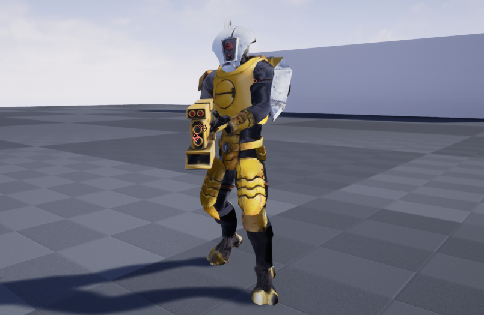

# WH40K

## Introduction

This Unreal Engine4 project contains a player controlled third-person character. The character is fully animated and modelled as a Tau Fire-Warrior from the popular Sci-Fi franchise Warhammer 40k. It also contains a controllable Imperial Space Marine Dreadnought, which is mostly animated and developed. Also within the project is several Enemy NPC's with Base AI implementation such as patrol and chase behaviours in regard to the player character.

## Updates

[Ork Disintegration Update](https://youtu.be/d9TjetxjR7U)

The Ork character now upon death has a chance to disintegrate.

[Ork Detection and Reaction Update](https://youtu.be/nmrP726CXhM)

The ork character now has some basic awareness which includes Patrolling, Detection and Attacking behaviours. Camera shakes added to player being hit and firing their weapon respectively. As well as hit reaction animations added to both the player character and the ork character.

[Ork Update](https://youtu.be/pqNLTIfLGpw0)

New Ork added with initially basic animations, WIP.

[Firewarrior Disintegration Update](https://youtu.be/3qsPk76Hqt0)

New Disintegration Material function added.

[Firewarrior Firing Mode Update](https://youtu.be/pK0db8ZnNM8)

WIP firing modes added to the pulse carbine to allow semi and full auto firing.

[Firewarrior Overheating Carbine Update](https://youtu.be/fhVUdq7pqh4)

Displaying the functionality of the overheating Carbine.

[Firewarrior Particle System Update](https://www.youtube.com/watch?v=piyJGVVz_1g)

Showcasing the newly added and changed particle systems used for the Carbine and its live ammunition.

[Firewarrior Crosshair & Projectile Update](https://www.youtube.com/watch?v=8rxM2nxBqzQ&feature=youtu.be)

Players crosshair has been replaced with a dynamic set that changes based on player speed at the moment. The projectile is now highly accurate being constrained to  the crosshairs location.

[Firewarrior animation & aiming update](https://www.youtube.com/watch?v=InKMYaX0KO4&feature=youtu.be)

The firewarrior is now using retargeted animations from the paragon assets available from the Unreal Store, Aiming has also been  tightened  up to allow for more accurate fire.

[Tau FireWarrior Enemy Interaction](https://www.youtube.com/watch?v=-QT0zYkL0tU&feature=youtu.be)

Showing the Ai enemies reacting to the player character and giving chase when the player is sighted.

[Tau FireWarrior AimOffset](https://www.youtube.com/watch?v=fo22MS3_BgI)

Currently the Fire Warrior has an Aim Offset implemented allowing it to rotate and follow the players view.

[Tau FireWarrior IK hand attachment](https://www.youtube.com/watch?v=AeFQHfd2CSk)

IK Setup to allow the Firewarriors left hand to remain in the grip of the Pulse Carbine and for a realistic posuture to remain without any deformations of the limbs.

## Further Media
[Space Marine Dreadnought Firing & Movement](https://www.youtube.com/embed/u8Nq3JJJQYM)

[Space Marine Dreadnought Flyby](https://www.youtube.com/embed/XF-2-xlHfeE)

[Tau FireWarrior Flyby](https://www.youtube.com/embed/qvmLaIHDQwk)

